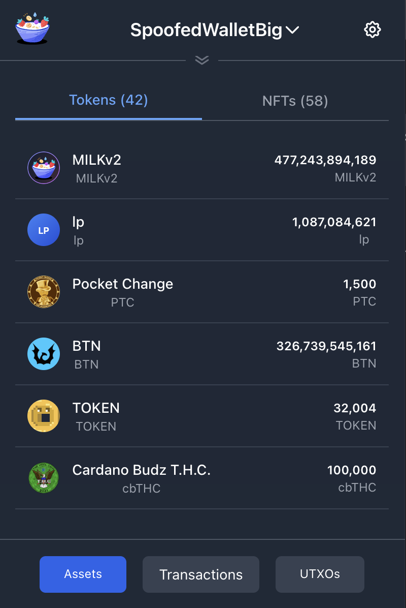
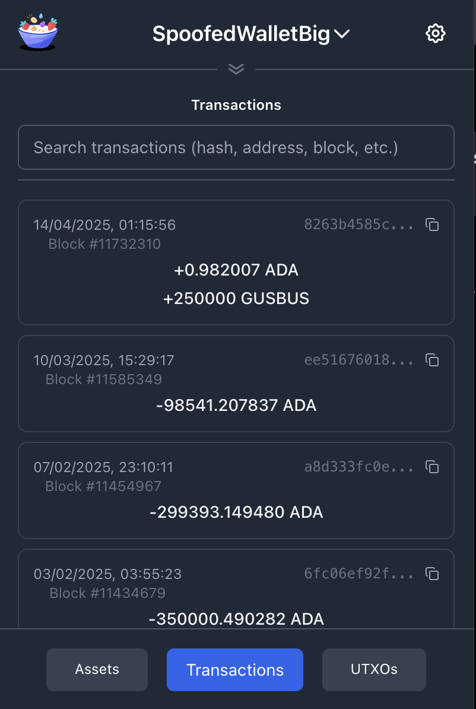
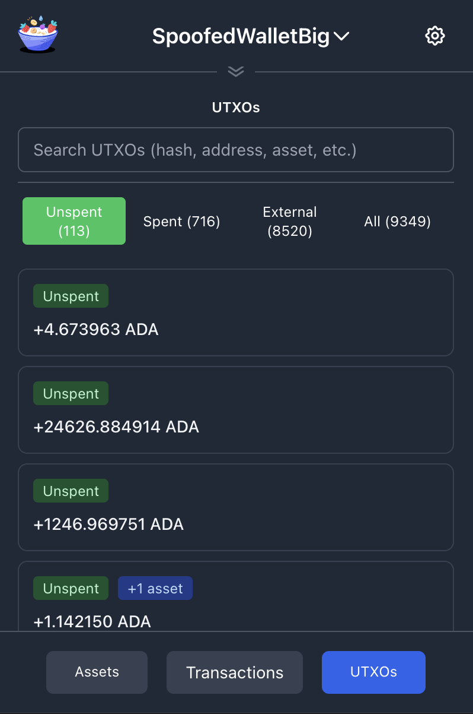

# DevX - A Cardano Wallet for Developers

A **developer-focused** Cardano wallet browser extension designed for dApp development and testing. Built with React, TypeScript, and modern web technologies, this wallet prioritizes developer experience over security and is **NOT intended for mainnet trading or storing real funds**.

⚠️ **This wallet is for development purposes only. Do not use with real funds or for production transactions.**

<p align="center">
  
  
  
</p>

## Features

- **Wallet Spoofing**: Create read-only wallets from any Cardano address for testing dApp interactions
- **Developer Experience**: Streamlined onboarding and reduced security friction for faster development
- **CIP-30 Support**: Full dApp connectivity with industry-standard wallet connector implementation
- **Network Support**: Mainnet and Preprod testnet for comprehensive testing scenarios
- **Transaction & UTXO Explorer**: Detailed blockchain data inspection tools
- **Multiple Wallet Types**: Create new wallets, import from seed, or spoof existing addresses
- **Modern UI**: Dark/light theme support with developer-friendly interface
- **Chrome Extension**: Built and tested specifically for Chrome

## Security

⚠️ **IMPORTANT SECURITY NOTICE** ⚠️

This wallet is designed with **reduced security measures** to prioritize developer experience over security:

- **Optional Passwords**: While we ask for a password by default, users can actively opt-out to reduce friction during development
- **Relaxed Security**: Loosened security constraints are intentional to improve development workflow
- **No Production Use**: This wallet should NEVER be used with real funds or for production transactions
- **Development Focus**: Security trade-offs are made specifically to enhance the developer experience

**Password Protection**: When a password is set, wallet information is encrypted. Password is required for seed phrase export if set.

**Data Management**: Users can delete individual wallets or completely wipe all extension data through settings.

🚨 **DO NOT use this wallet on mainnet with real funds. This is a development tool only.**

## Installation & Development

### Prerequisites

- Node.js >= 18.19.1
- pnpm >= 9.9.0 (`npm install -g pnpm`)

### Setup

1. **Clone and install dependencies:**
   ```bash
   git clone https://github.com/MuesliSwapLabs/devx-cardano-wallet
   cd devx-cardano-wallet
   pnpm install
   ```

### Development

- **Development mode:** `pnpm dev`
- **Build for production:** `pnpm build`
- **Create extension zip:** `pnpm zip`

### Load Extension in Chrome

1. Open `chrome://extensions`
2. Enable "Developer mode"
3. Click "Load unpacked" and select the `dist` folder

### Code Quality

- **Type checking:** `pnpm type-check`
- **Linting:** `pnpm lint`
- **Code formatting:** `pnpm prettier`
- **Testing:** `pnpm e2e` (requires built extension)

## Use Cases

This developer wallet is perfect for:
- **dApp Development**: Test your Cardano dApps with various wallet scenarios
- **Address Spoofing**: Simulate interactions with any existing Cardano address
- **Transaction Analysis**: Inspect transaction details and UTXO structures

## Architecture

This is a monorepo built with:
- **Frontend**: React 18 + TypeScript + Vite
- **Styling**: TailwindCSS  
- **Build System**: Turborepo + pnpm workspaces
- **Blockchain**: @emurgo/cardano-serialization-lib-browser
- **Storage**: IndexedDB + Chrome storage APIs
- **Developer Focus**: Reduced security constraints for enhanced development experience

## Package Overview

| Package | Description |
|---------|-------------|
| `blockchain-provider` | Cardano blockchain interaction layer and Blockfrost API integration |
| `dev-utils` | Development utilities including manifest parser and logging tools |
| `hmr` | Custom Hot Module Replacement system for extension development |
| `i18n` | Internationalization system with type-safe translation support |
| `shared` | Common types, messaging system, and utilities shared across components |
| `storage` | Chrome storage API wrappers with React hooks and IndexedDB management |
| `tailwind-config` | Shared Tailwind CSS configuration for consistent styling |
| `tsconfig` | TypeScript configuration presets for the monorepo |
| `ui` | Shared UI components and design system elements |
| `vite-config` | Shared Vite build configuration for all packages |
| `wallet-manager` | Core wallet business logic for creation, import, and key management |
| `zipper` | Extension packaging utilities for creating distribution files |

## Credits

This project is built upon the [Chrome Extension Boilerplate with React + Vite](https://github.com/Jonghakseo/chrome-extension-boilerplate-react-vite) by Jonghakseo. Special thanks for providing the excellent foundation for modern Chrome extension development.

## License

MIT